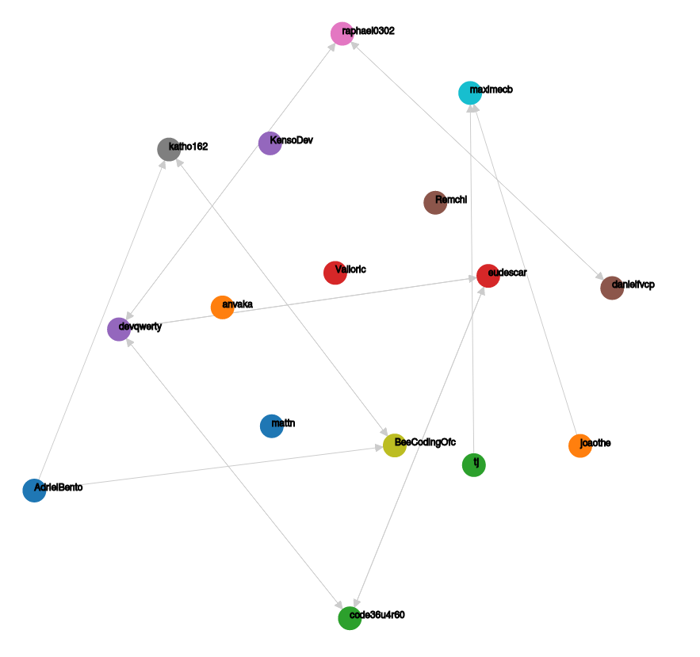

# GitHub Graph Extension - (Beta)

Visualize the structure of your GitHub network (follower and following).

### How to use it?
* Install the [Chrome Browser](https://www.google.com/chrome/)
* Visit `chrome://extensions`
* Enable Developer mode
* Click on the `Loading unpacked extension...` button
* Select the folder `extension` (folder of this repository)

### How does it work?

### Next Steps
* Visualize node profile
* Donwload graph

### Authors
* **Mateus Esdras** - *Initial work* - [ezradiniz](https://github.com/ezradiniz)

### License
This project is licensed under the MIT License - see the [LICENSE](LICENSE) file for details
